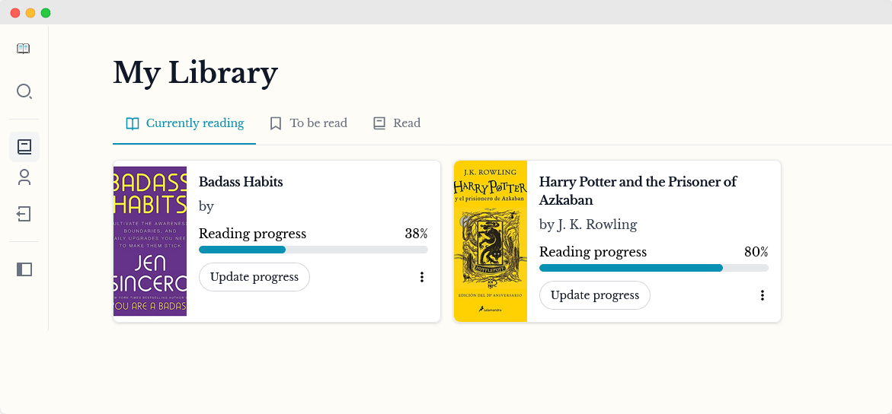

<!-- PROJECT LOGO -->
 

  

<h3 align="center">BookLogr</h3>

  

    A simple, self-hosted service to keep track of your personal library.
     
    <a href="https://booklogr.app/docs/Getting%20started"><strong>🗒️Explore the docs »</strong></a>
     
     
    <a href="https://demo.booklogr.app">💻View Demo</a> |
    <a href="https://github.com/Mozzo1000/booklogr/issues">🐞Report Bug</a> |
    <a href="https://github.com/Mozzo1000/booklogr/issues">✨Request Feature</a> |
    <a href="https://status.booklogr.app">👷Service status</a> |
    <a href="https://github.com/sponsors/Mozzo1000">❤️Sponsor this project</a>
  

## 👉About the project
BookLogr is a web app designed to help you manage your personal book library with ease. This self-hosted service ensures that you have complete control over your data, providing a secure and private way to keep track of all the books you own, read, or wish to read.
Optionally you can also display your library proudly to the public, sharing it with your friends and family.

> [!IMPORTANT]
> * This project is under **active** development.
> * Expect bugs and breaking changes.

## ✨Features
* Easily look up books by title or isbn. Powered by [OpenLibrary](https://openlibrary.org/)
* Add books to predefined lists: _Reading_, _Already Read_, _To Be Read_, and _Did not finish_.
* Manually add books that are not found in the OpenLibrary.
* Track your current page in the book you are reading.
* Share a public profile of your library with others.
* Rate books you have read using a 0.5 to 5-star scale.
* Take short notes and save quotes from the books you read.
* Automatically share your reading progress to Mastodon.
* Export your data in multiple formats, including CSV, JSON, and HTML.
* Supports SQLite (default) or PostgreSQL as databases.

## 🖥 Install
BookLogr is made to be self-hosted and run on your own hardware.

Check out the [Getting Started guide](https://booklogr.app/docs/Getting%20started) for step-by-step instructions.

## 🛠️Development
See [development instructions](https://github.com/Mozzo1000/booklogr/wiki/Development) on the wiki to get started.

## 🙌Contributing
All contributions, from bug reports to feature requests and code submissions are welcome!

### Translations

We use Crowdin to manage our localization efforts. This is our preferred way to receive translation contributions, as it requires no coding knowledge.

* **Standard Translation:**: Join our [Crowdin Project](https://crowdin.com/project/booklogr) to start translating right away.
* * **In-Context Translation:** Translate strings directly inside the live application user interface at [https://translate-live.booklogr.app](https://translate-live.booklogr.app).
* For advanced or manual translation workflows (via pull requests), please check out our [Translation Guide](https://booklogr.app/docs/Developer/Translation).

> [!TIP]
> **Enjoying BookLogr?**  Help keep the project running and cover our monthly hosting costs. [Sponsor on GitHub ❤️](https://github.com/sponsors/Mozzo1000)
> You can also [read more about our monthly costs](https://booklogr.app/sponsor) on our website.

### 🤝 Sponsors
Huge thanks to our amazing sponsors for helping cover our infrastructure and hosting costs!
<!-- sponsors --><!-- sponsors -->

### ❤️ Contributors
Thanks to these wonderful people for contributing their time and talent to this project!

## 🧾License
This project is licensed under the Apache License, Version 2.0. See [LICENSE](LICENSE) for the full license text.
