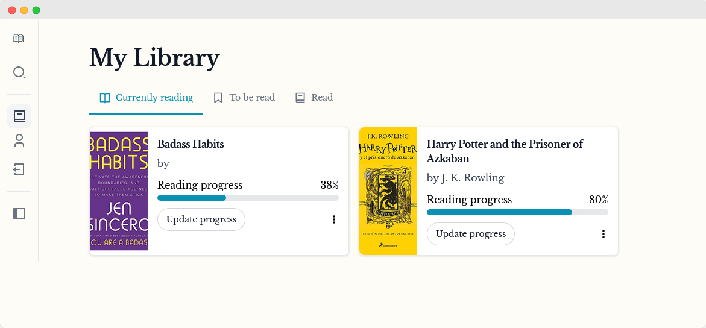

<!-- PROJECT LOGO -->
 

  

<h3 align="center">BookLogr</h3>

  

    A simple, self-hosted service to keep track of your personal library.
     
    <a href="https://github.com/Mozzo1000/booklogr/wiki"><strong>🗒️Explore the docs »</strong></a>
     
     
    <a href="https://demo.booklogr.app">💻View Demo</a> |
    <a href="https://github.com/Mozzo1000/booklogr/issues">🐞Report Bug</a> |
    <a href="https://github.com/Mozzo1000/booklogr/issues">✨Request Feature</a> |
    <a href="https://status.booklogr.app">👷Service status</a>
  

## 👉About the project
BookLogr is a web app designed to help you manage your personal book library with ease. This self-hosted service ensures that you have complete control over your data, providing a secure and private way to keep track of all the books you own, read, or wish to read.
Optionally you can also display your library proudly to the public, sharing it with your friends and family.

> [!IMPORTANT]
> * This project is under **active** development.
> * Expect bugs and breaking changes.

## ✨Features
* Easily look up books by title or isbn. Powered by [OpenLibrary](https://openlibrary.org/)
* Add books to predefined lists, reading, already read and to be read.
* Keep track of what page you are on with your current book.
* Have a public profile of your library available to all.
* Rate you read books with 0.5-5 stars.
* Take short notes on the books you read.

## 🖥 Install
BookLogr is made to be self-hosted and run on your own hardware.

See [how to install with Docker](https://github.com/Mozzo1000/booklogr/wiki/Install-with-Docker) to get started.

## 🛠️Development
See [development instructions](https://github.com/Mozzo1000/booklogr/wiki/Development) on the wiki to get started.

## 🙌Contributing
All contributions are welcome!

## 🧾License
This project is licensed under the Apache License, Version 2.0. See [LICENSE](LICENSE) for the full license text.